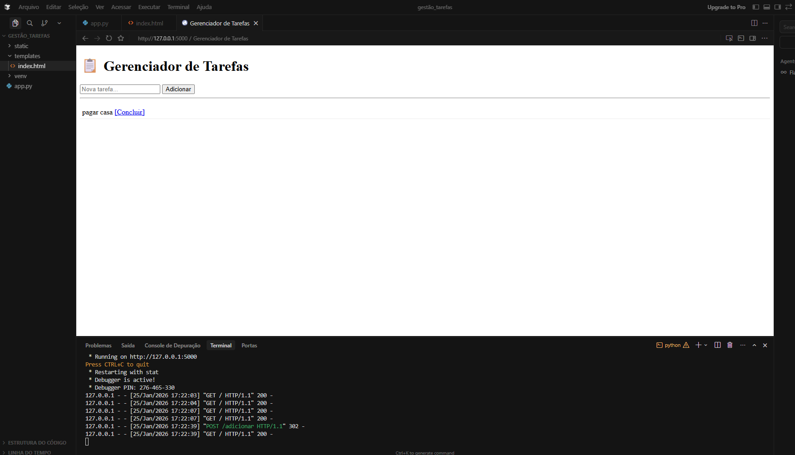
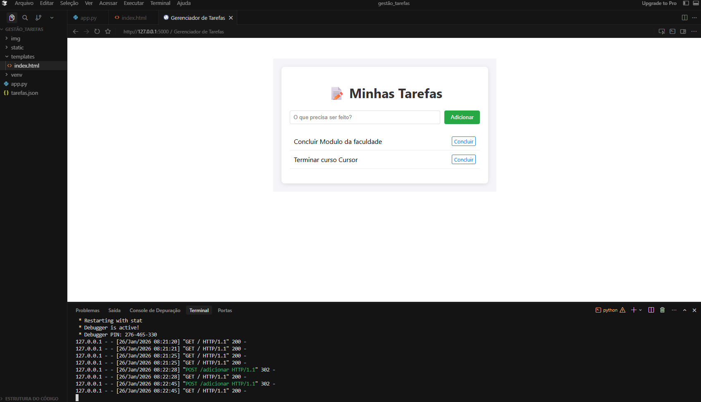
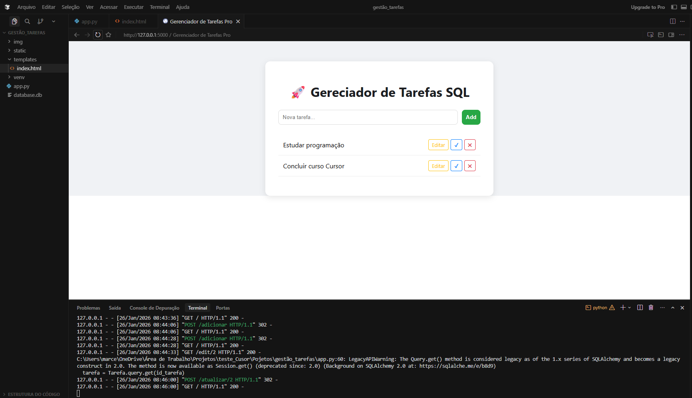
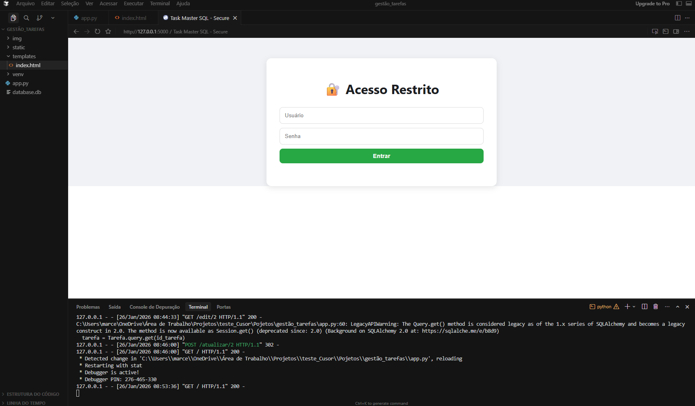
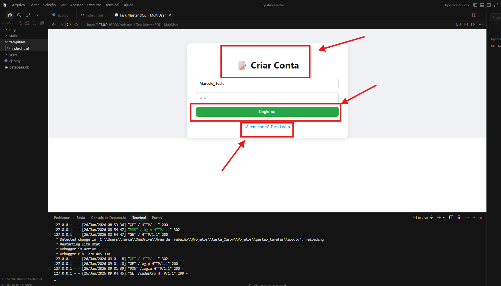
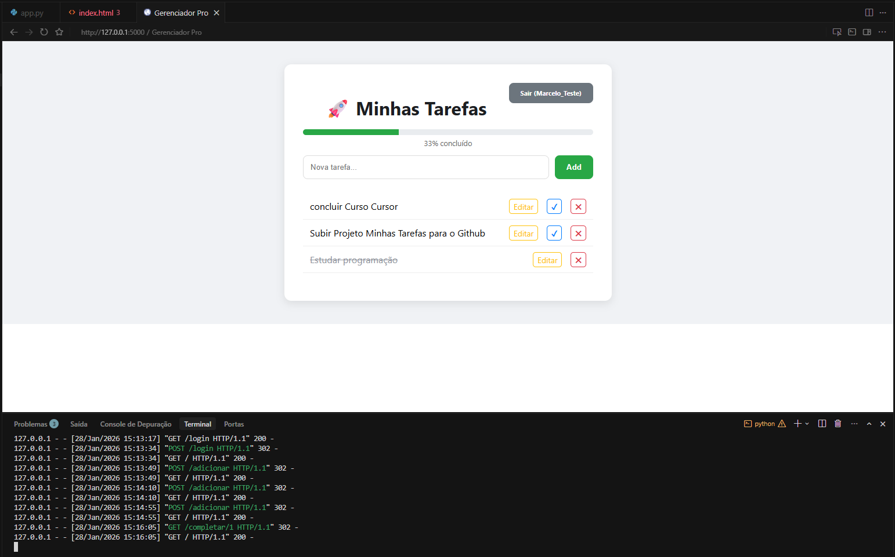
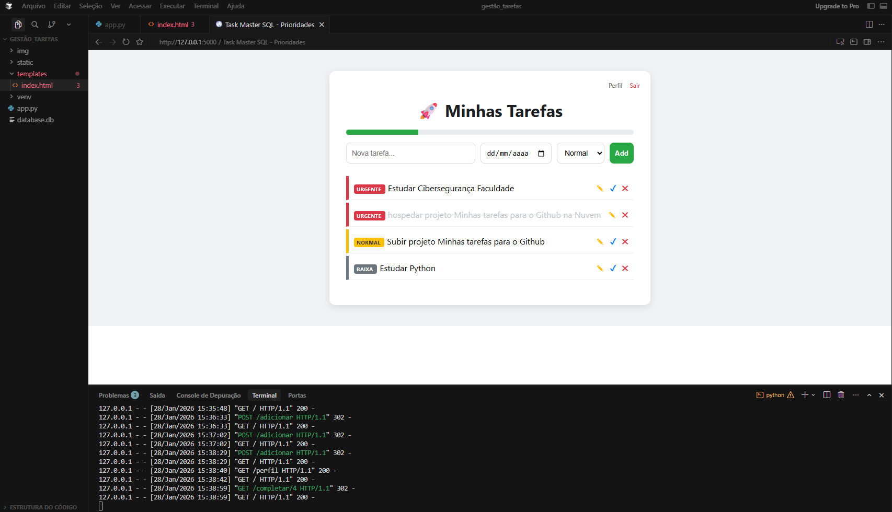
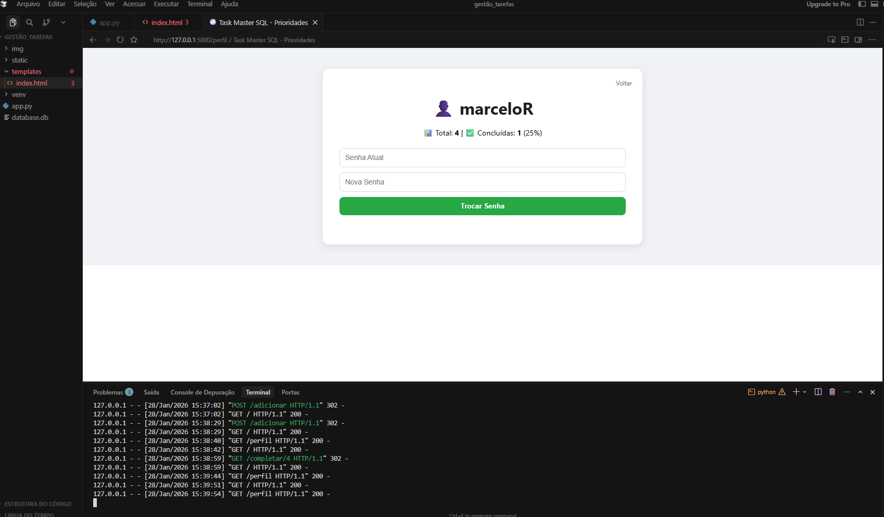
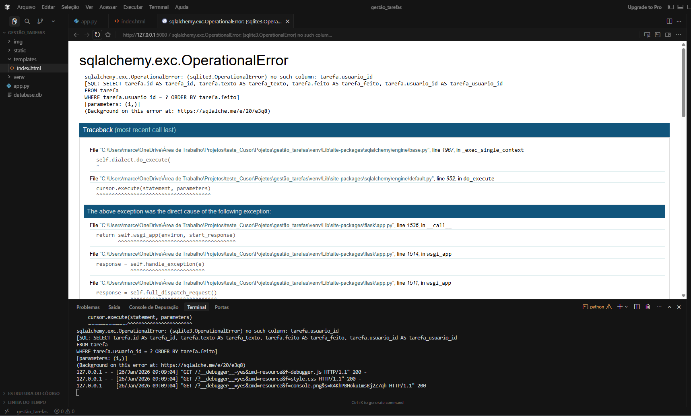

# 🚀 Task Master SQL - Ecossistema de Gestão


Este projeto representa minha evolução prática como estudante de Ciência da Computação. O que começou como um simples script de rotas em Flask evoluiu para uma aplicação Web completa, focada em segurança, persistência de dados e experiência do usuário.

---

## 🛠️ Tecnologias e Conceitos Chave
* **Backend:** Python 3 + Flask (Microframework)
* **Banco de Dados Relacional:** SQLite gerenciado via SQLAlchemy (ORM) e Flask-Migrate para migrações seguras.
* **Cibersegurança:** Implementação de hashing de senhas (Werkzeug) e controle robusto de sessões de usuário.
* **Frontend:** Interface responsiva utilizando Jinja2 para templates dinâmicos e CSS moderno.

---

## 📈 Linha do Tempo Visual da Evolução

### 1. O Protótipo (MVP)
O projeto nasceu focado apenas em entender a lógica de rotas do Flask e manipulação de listas em memória.



### 2. Refinamento de Interface (UI/UX)
Transição de listas simples para um design centrado em "Cards", melhorando a apresentação visual.



### 3. Persistência de Dados (SQL)
Abandono do armazenamento em memória/JSON para a implementação de um banco de dados relacional real.



### 4. Segurança e Multi-Usuário
Desenvolvimento de um sistema completo de autenticação (Login/Cadastro), garantindo o isolamento dos dados de cada usuário.





### 5. Funcionalidades Avançadas (Dashboards)
Implementação de barra de progresso dinâmica, sistema de prioridades visuais e datas de vencimento.





### 6. Área do Usuário (Perfil)
Criação de um painel pessoal com estatísticas de desempenho e gestão segura de credenciais.



---

## 🧠 Desafios de Engenharia Superados
Durante o desenvolvimento, enfrentei e resolvi desafios técnicos importantes para um desenvolvedor backend:

1.  **Inconsistência de Schema:** Superei erros críticos de sincronização de banco de dados (`OperationalError`) ao evoluir a estrutura das tabelas, aprendendo a usar migrações.
    
    
2.  **Modernização de Código:** Tratamento e atualização de chamadas de **API legadas** no **SQLAlchemy** para garantir compatibilidade futura.

---

## 🚀 Como Executar o Projeto Localmente

Pré-requisitos: **Python 3** instalado.

1.  **Clone o repositório:**
    ```bash
    git clone [https://github.com/SEU_USUARIO/SEU_REPOSITORIO.git](https://github.com/SEU_USUARIO/SEU_REPOSITORIO.git)
    
    cd SEU_REPOSITORIO
    ```

2.  **Crie e ative um ambiente virtual:**
    ```bash
    # Windows
    python -m venv venv
    source venv/Scripts/activate
    
    # Linux/Mac
    python3 -m venv venv
    source venv/bin/activate
    ```

3.  **Instale as dependências:**
    ```bash
    pip install flask flask-sqlalchemy flask-migrate werkzeug
    ```

4.  **Inicialize o Banco de Dados:**
    ```bash
    flask db init
    flask db migrate -m "Migração Inicial"
    flask db upgrade
    ```

5.  **Execute a aplicação:**
    ```bash
    python app.py
    ```
    Acesse em seu navegador: `http://127.0.0.1:5000`

---

## 📄 Licença

Este projeto está licenciado sob a Licença MIT - sinta-se livre para usar, modificar e distribuir para fins educacionais. Veja o arquivo `LICENSE` para mais detalhes.