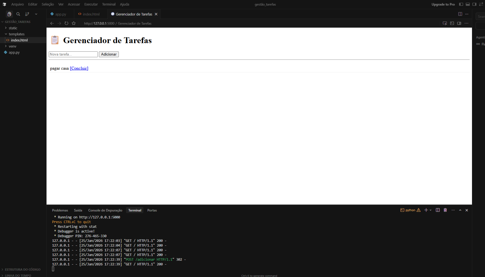
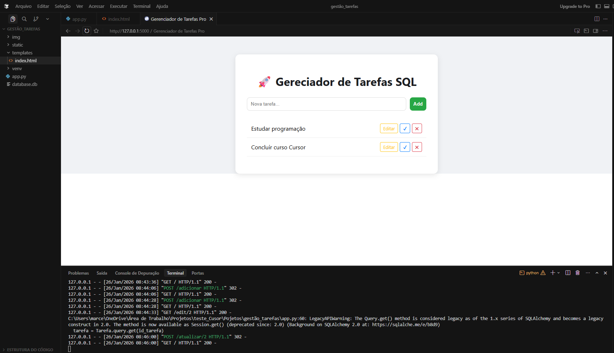
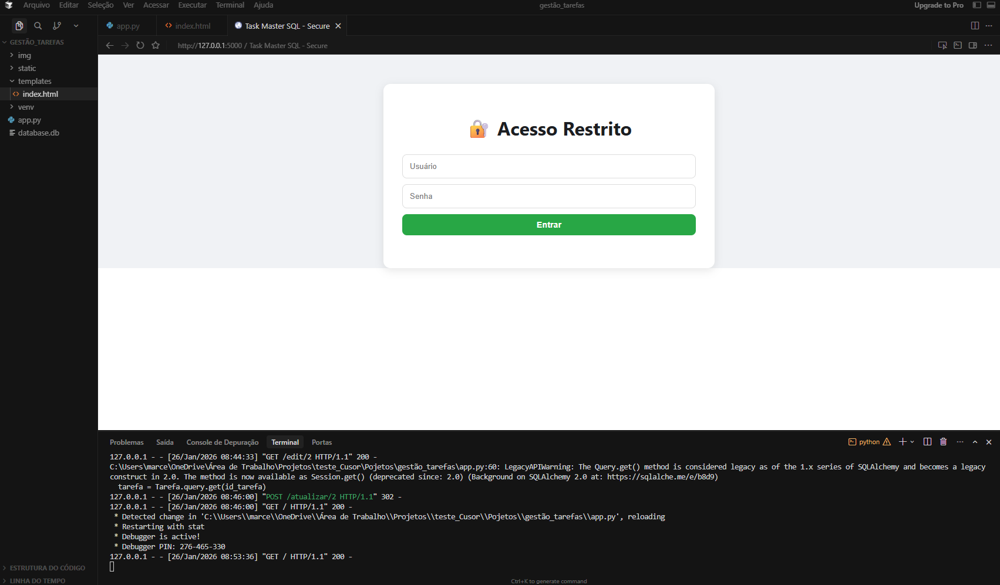
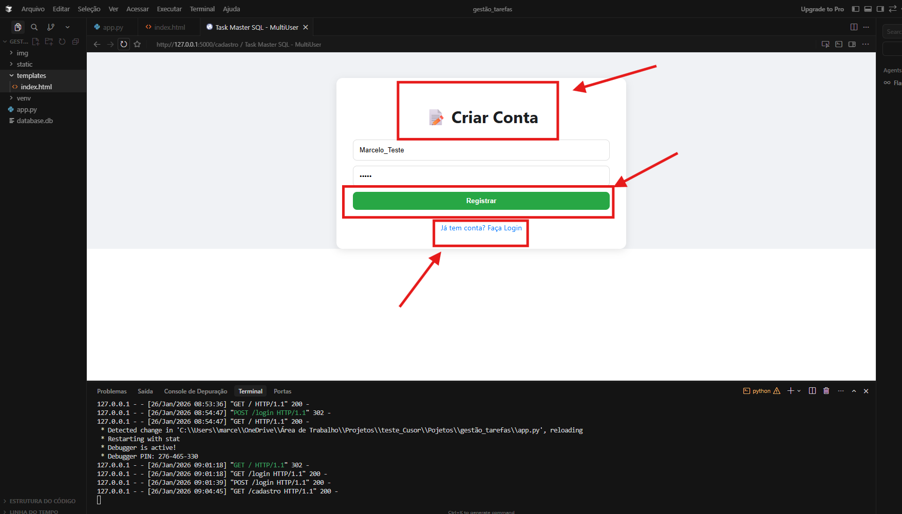
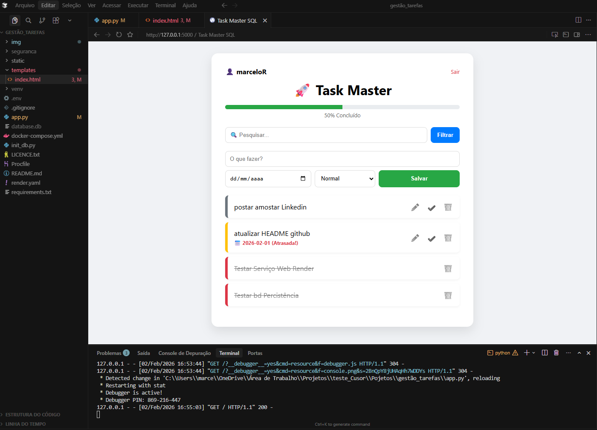
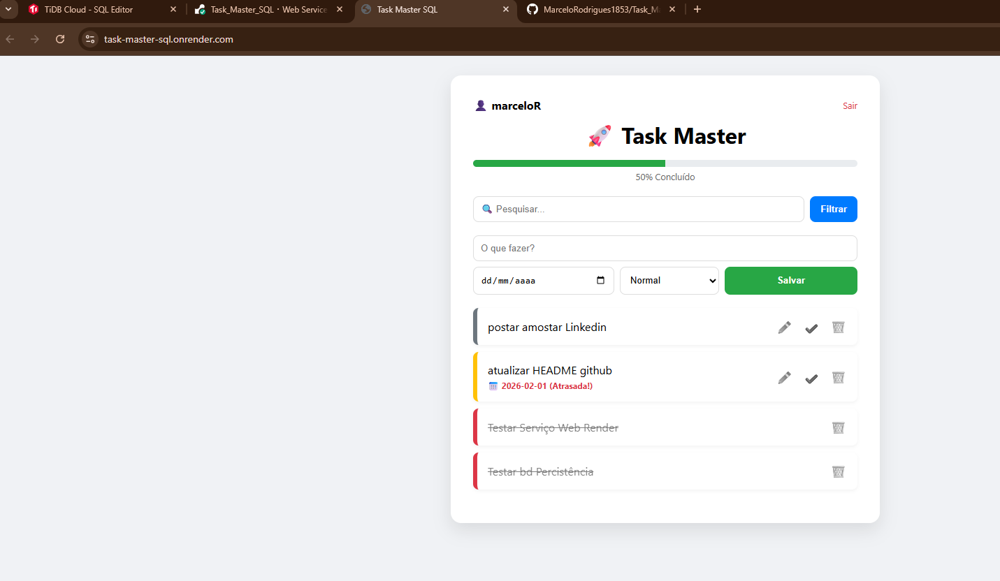
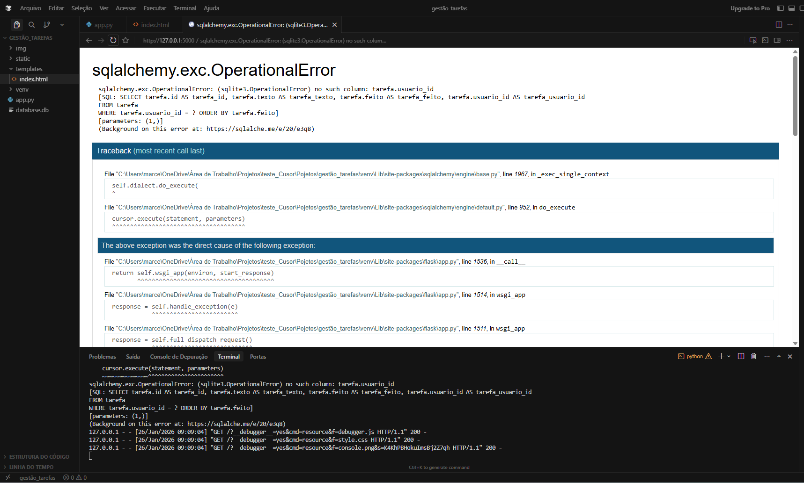

# 🚀 Task Master SQL - Ecossistema de Gestão (Cloud Native)

Este projeto representa minha evolução técnica no curso de Ciência da Computação, transformando um protótipo acadêmico em uma solução real de **Cloud Computing** para impacto social.

---

## 🌐 Projeto de Extensão Universitária
Este software integra o **Projeto de Extensão II**, sob o programa de **Ação e Difusão Cultural**.
* **Objetivo:** Democratizar o acesso a ferramentas de gestão para grupos culturais e artesãos.
* **Metodologia PDCA:** Desenvolvimento orientado pela resolução de problemas reais da comunidade.

---

## 📈 Linha do Tempo e Evolução Visual

### 1. O Protótipo Inicial (MVP)
Focado no entendimento da lógica de rotas e manipulação de dados básicos.

### 2. Implementação de Persistência SQL e UI
Transição para o armazenamento relacional e design centrado no usuário.

### 3. Autenticação e Segurança (Multi-usuário)
Criação do sistema de login e isolamento de dados por perfil.

### 4. Dashboards e Novas Funcionalidades (Cloud Ready)
Versão final com barra de busca, filtros de prioridade e integração com **TiDB Cloud**.

---

## 🛠️ Tecnologias e Desafios de Engenharia
* **Arquitetura Híbrida:** Uso de SQLite para testes locais e **TiDB Cloud (MySQL)** para produção no **Render**.
* **Gestão de Prazos:** Lógica **para** tratamento de datas de vencimento com alertas visuais de atraso.
* **Segurança de Dados:** Conexões criptografadas (SSL/TLS) e proteção contra erros de schema (`OperationalError`).

---

## 🚀 Como Executar
1. **Clone:** `git clone https://github.com/MarceloRodrigues1853/Task_Master_SQL.git`

2. **Ambiente:** `python -m venv venv` e `pip install -r requirements.txt`

3. **Variáveis:** Configure o arquivo `.env` com suas chaves de banco de dados e `SECRET_KEY`.

4. **Run:** `python app.py`

---

## 📄 Licença
Este projeto está licenciado sob a Licença MIT.